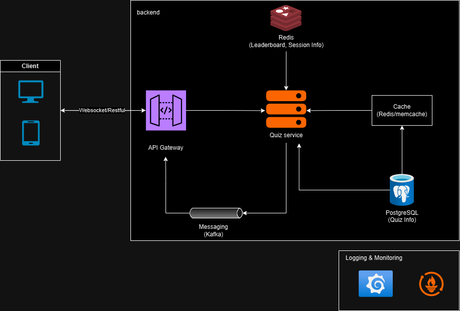
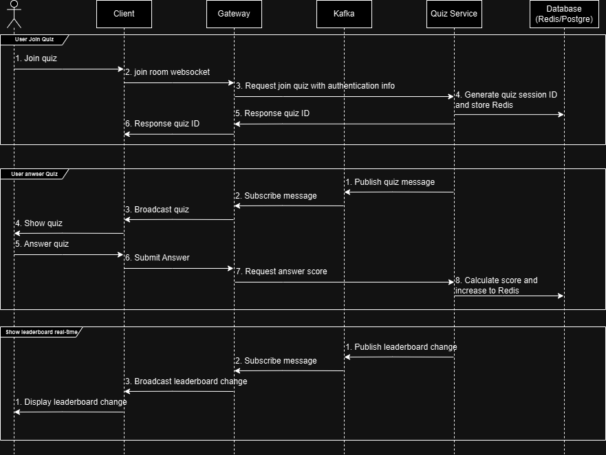

# Real-Time Vocabulary Quiz Coding Challenge

## Overview

The Real-Time Vocabulary Quiz Backend Challenge involves building a backend system to power a multiplayer, real-time vocabulary quiz game. This README outlines the key objectives, requirements, sytem design for the backend service.

## Objectives

1. Enable users to join a quiz session using a unique quiz ID and allow multiple users to participate in the same session simultaneously.
2. Implement real-time score updates as users submit answers, ensuring the scoring system is accurate and consistent.
3. Create a real-time leaderboard to display the current standings of all participants, updating promptly as scores change.
4. Design a scalable, low-latency backend architecture to handle multiple concurrent users effectively.
5. Demonstrate clean code practices, effective use of databases, and integration of real-time messaging protocols.

---

## Requirements

For detailed requirements, refer to the requirements.md file.

---

## System Design

The following system design outlines the architecture for the Real-Time Vocabulary Quiz backend service:



### Key Components:

1. **Client**:
   - Users interact with the system via WebSocket or RESTful APIs.
   - Supported platforms include web and mobile.

2. **API Gateway**:
   - Manages incoming client requests.
   - Routes requests to appropriate backend quiz services.

3. **Quiz Service**:
   - Handles quiz logic, user sessions, and answers submission.
   - Manages communication with the cache, database, and messaging systems.

4. **Redis**:
   - Used for maintaining leaderboards and session information.
   - Provides low-latency real-time data.

5. **Cache**:
   - Stores frequently accessed quiz information for fast retrieval.

6. **PostgreSQL**:
   - Used as the main database for storing quiz-related information, such as questions and user data.

7. **Messaging (Kafka)**:
   - Broadcast message from services to user through websocket connection.

8. **Logging & Monitoring**:
   - Provides insights into system performance, errors, and debugging.
   - Tools like Prometheus and Grafana are used for monitoring and visualization.

### Data Flow for Key Features

The following data flow diagram illustrates the interaction between different components for the three main features of the Real-Time Vocabulary Quiz system:



#### 1. User Joins Quiz
1. User joins a quiz from the **Client**.
2. Client establishes a WebSocket connection with the **Gateway**.
3. The Gateway sends a request to **Quiz Service** with authentication info.
4. Quiz Service generates a quiz session ID and stores it in **Redis**.
5. Quiz Service responds with the quiz ID to the Gateway.
6. Gateway sends the quiz ID back to the Client.

#### 2. User Answers Quiz
1. Quiz Service publishes the quiz message via **Kafka**.
2. Gateway subscribes to the Kafka topic.
3. Gateway broadcasts the quiz to connected users.
4. Client displays the quiz to the user.
5. User submits an answer through the Client.
6. Gateway sends the answer to the Quiz Service.
7. Quiz Service calculates the score and updates Redis sorted set.

#### 3. Real-Time Leaderboard Updates
1. Quiz Service publishes leaderboard changes via **Kafka**.
2. Gateway subscribes to the leaderboard updates from Kafka.
3. Gateway broadcasts the updated leaderboard to connected users in real-time.
4. Client displays the leaderboard changes promptly.

---

## Installation and Setup

### Prerequisites:

1. Node.js or Python installed on your system.
2. Docker for containerization (optional).
3. Redis for real-time messaging (optional).

### Steps:

1. Clone the repository:

   ```bash
   git clone <repository-url>
   cd real-time-vocabulary-quiz
   ```

2. Install dependencies:

   - For Node.js:
     ```bash
     npm install
     ```
   - For Python:
     ```bash
     pip install -r requirements.txt
     ```

3. Set up the database:

   - Run the database schema migration tool (e.g., Sequelize for Node.js or Alembic for Python).
   - Seed the database with vocabulary questions.

4. Run the application:

   - Locally:
     ```bash
     npm start  # for Node.js
     python app.py  # for Python
     ```
   - Using Docker:
     ```bash
     docker-compose up
     ```

5. Start Redis (if required for messaging):

   ```bash
   redis-server
   ```

---

## Future Improvements

1. Add support for multilingual vocabulary quizzes.
2. Implement user ranking and achievements.
3. Scale horizontally with sharding for Redis or Kafka.
4. Add AI-based question generation.
